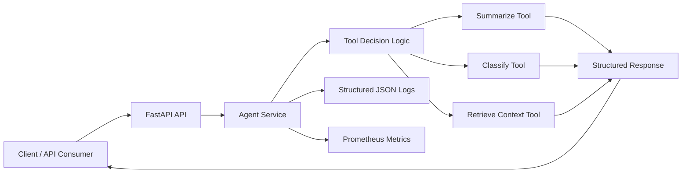

# Day 1 - AI Agent System Architecture

**Author:** Abdalla Mady

## Story

Day 1 establishes the production-ready baseline:

- API-first agent service
- tool-based execution
- logging and metrics
- containerization and Kubernetes readiness
