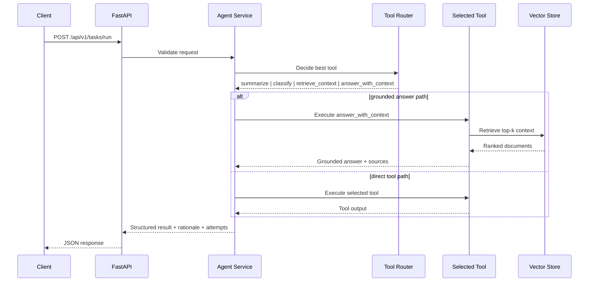

# Day 2 - Agent Flow, Retrieval, and Fallback Execution

**Author:** Abdalla Mady

## Story

Day 2 extends the baseline service with:

- retrieval-backed execution
- vector store abstraction
- richer tool registry metadata
- retry-ready execution flow
- structured attempt history in responses
