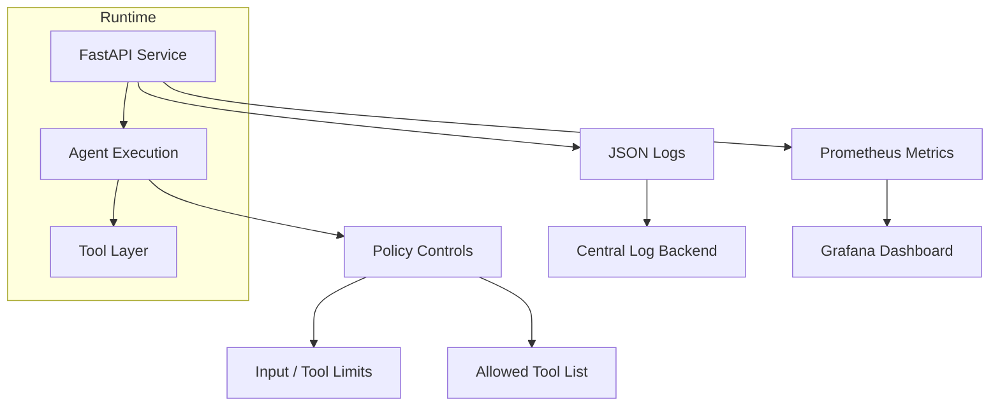

# Day 3 - Observability and Governance

**Author:** Abdalla Mady

## Story

Day 3 frames the service as an enterprise AI system:

- observability by default
- controlled tool execution
- runtime governance
- clear path to dashboards, alerts, and policies
